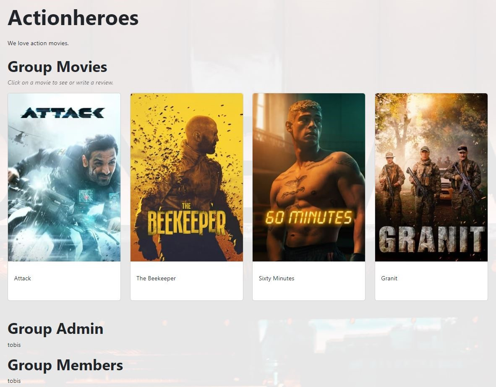

# **Movie Reviews with Friends**

Live Website: [Movie Reviews with Friends](https://movie-reviews-with-friends-96186426856b.herokuapp.com/)

# **Purpose**

Movie Reviews with Friends is a web application built with Django that brings movie enthusiasts together to discuss and review their favorite films. The platform allows users to create or join groups centered around specific movie subjects, fostering a community where members can share their passion for cinema.

# **User-Experiance-Design**

## **Project Goals**

### **User/Visitor Goals**

+ **Facilitate Community Building**  
Enable users to create and join groups based on specific movie subjects, fostering a sense of community among like-minded individuals.

+ **Curate Movie Catalogs**  
Provide a space within each group for users to add and explore movies related to the group's theme, creating a curated catalog of films.

+ **Enable Movie Reviews**  
Allow users to post reviews for movies within the groups, providing a platform for expressing opinions.

### **Site Owner Goals**

+ **Community Growth**  
Increase the number of registered users and groups on the platform.

+ **Content Curation**  
Promote the creation of high-quality content within groups, ensuring that the movie catalogs and discussions offer value to the community.

+ **Positive User Experience**  
Prioritize a positive and user-friendly experience, making the platform enjoyable and accessible for users of varying levels of technical expertise.

By achieving these goals, the Movie Reviews with Friends website aims to become a go-to platform for movie enthusiasts to connect, discuss, and share their passion for cinema within a vibrant and supportive community.

## **Agile Planning**

This project was developed using agile methodologies by delivering small features in incremental sprints. There were 9 sprints in total, spaced out evenly over 3 weeks.

### Issue Labeling System

**Must Have**: Essential features or tasks that are critical for the project's success.  
+ Priority 1: High urgency, requiring immediate attention.
+ Priority 2: Important but can be addressed after Priority 1 tasks.
+ Priority 3: Lower priority, can be tackled after both Priority 1 and Priority 2 tasks.

**Should Have**: Important features or tasks that significantly contribute to the project.
+ Priority 1: High urgency, should be addressed soon.
+ Priority 2: Important but not as critical as Priority 1 tasks.
+ Priority 3: Lower priority, can be tackled after higher-priority Should Have tasks.

**Could Have**: Nice-to-have features or tasks that are not critical but would be beneficial.
+ Priority 1: High urgency, should be addressed soon if possible.
+ Priority 2: Less critical than Priority 1 tasks.
+ Priority 3: Lower priority, can be tackled after higher-priority Could Have tasks.

**Example**:
A "Must Have" with "Priority 1" is of the highest importance and requires immediate attention.  
A "Should Have" with "Priority 3" is important but can wait until higher-priority Should Have tasks are addressed.

This labeling system helps in prioritizing tasks based on both importance and urgency, providing a comprehensive view of the project's needs.

The Kanban board was created using github projects and can be located [here](https://github.com/users/NixTS/projects/5/views/1?visibleFields=%5B%22Title%22%2C%22Assignees%22%2C%22Status%22%2C%22Labels%22%2C%22Milestone%22%5D&sortedBy%5Bdirection%5D=asc&sortedBy%5BcolumnId%5D=Milestone) and can be viewed to see more information on the project cards.

### **Milestones**

The Project has 9 main Milestones:

**Database models**  
The foundation of our project begins with defining and creating robust database models. This milestone involves designing the architecture of our database, outlining the relationships between different entities, and ensuring data integrity.

**Movies**  
Implementing the Movies milestone involves integrating functionality related to movie management. This includes features such as fetching data from the TMDB API, storing the data and displaying the data.

**Groups**  
Groups represent a collaborative aspect of our project. This milestone involves creating a system for users to form and participate in groups. A core component of this project. 

**Custom Users**  
Creating a system of custom users is a pivotal step in tailoring our project to the needs of our users. This milestone involves implementing user registration and profile management.

**Reviews in Groups**  
Enabling users to share their thoughts and opinions on movies within groups is the focus of this milestone. Users can create, view, edit, and delete reviews within a group.

**CRUD functionality**  
The CRUD (Create, Read, Update, Delete) functionality milestone is a step that involves implementing operations for managing various entities, ensuring users have full control over their interactions with the application.

**Security and Authentication**  
Ensuring the security of user data and the authentication process is crucial. This milestone involves implementing robust security measures, including error handling and authorization mechanisms for each function (CRUD).

**Styling**  
The styling milestone focuses on enhancing the user interface and overall aesthetics of the application. This involves creating a visually appealing and user-friendly design to enhance the user experience.

**Documentation**  
This milestone encompasses all tasks and stories related to documentation essential for capturing the application development lifecycle. Its primary objective is to produce comprehensive documentation that show every stage of development.

## **User Stories**

**Database models**
+ As a developer I need to create the database models so that I can start implementing features.

**Movies**
+ As a site user I want to display a list of movies so that I can get additional informations about them.
+ As a site user I can click on a movie so that I can get additional informations about it.

**Groups**
+ As a site user I can create a group so that I can be in a review group with others.
+ As a site user I can display all available groups so that i can join a group of my interest.
+ As a site user I can click on a group do display additional informations so that can decide if i want to join.
+ As a site user I can join a group of my interest so that I can review movies.
+ As a group member I can add movies to my groups so that my group can reviews these movies.

**Custom Users**
+ As a site user I can create a profile so that I can use this sites functionality.
+ As a site user I want to find other users on this page.

**CRUD functionality**
+ As a group member I can edit my reviews so that I can correct my own reviews if I change my mind or find typos or formatting issues.
+ As a group admin I can edit my groups so that I can adjust future changes to the group.
+ As a site user, I want feedback when performing specific actions to confirm the acceptance of my submission

**Security and Authentication**
+ As a developer I need to set up error pages I can inform my users if an error occured.
+ As a developer I need to set up an admin page so that i can manage my database.
+ As a developer, I require secure access to CRUD features to ensure the integrity and safety of user data.

**Styling**
+ As a user, I want a persistent navigation bar and footer for streamlined navigation and easy access to key features.
+ As a site user I want a welcoming page greeting me and displaying important informations.

**Documentation**
+ Complete readme documentation

## **Fulfillment & Structure**

**Database models**
> As a developer I need to create the database models so that I can start implementing features.

**Movies**
> As a site user I want to display a list of movies so that I can get additional informations about them.

The Movies page is intentionally streamlined, showcasing only essential information: the movie poster and title. This design prioritizes a efficient scrolling experience, ensuring users can navigate without the distraction of information overload.

> As a site user I can click on a movie so that I can get additional informations about it.

In the Movie Details section, users can get more comprehensive informations about movies, including a movie description, genres, release date, and runtime. For logged-in users, a feature allowing them to add the movie to any groups they are part of, enhancing their engagement with the Movie Reviews with Friends community.

**Groups**
> As a site user I can create a group so that I can be in a review group with others.

As a logged-in user, the group creation button on the groups list is used for the creation of a group. The creation form is designed with an emphasis on simplicity and minimalism.

> As a site user I can display all available groups so that i can join a group of my interest.

The groups list showcases group names, communicating their respective interest fields.

> As a site user I can click on a group do display additional informations so that can decide if i want to join.

The group details page offers the following informations: the group name, description, movies added by the group, the group admin and the group members.

> As a site user I can join a group of my interest so that I can review movies.

On the group details page, a user-friendly "Join Group" button is prominently displayed. Users can effortlessly click this button to become a member of a group aligning with their interests.

> As a group member I can add movies to my groups so that my group can reviews these movies.

The movie details page features a dropdown menu exclusively presenting the groups to which the user belongs, accompanied by an "Add to Group" button. This functionality allows users to add the movie to the selected group.

**Custom Users**
> As a site user I can create a profile so that I can use this sites functionality.

Account registration is designed for simplicity. Users only need to provide a unique username, an email address, and a password with confirmation. This straightforward process allows users to explore the website's features promptly. Note that email confirmation is not required, providing users with immediate access upon registration.

>As a site user I want to find other users on this page

The Users page, fashioned similarly to the Groups list, provides a comprehensive roster of all currently registered users on the website.

The User Details page provides a personalized glimpse into each user's interests, featuring their username, a self-written bio, and the date they joined the community. 

**CRUD functionality**
> As a group member I can edit my reviews so that I can correct my own reviews if I change my mind or find typos or formatting issues.

Users have the ability to edit reviews by navigating to the review page within a specific group. Within this section, users can freely modify or delete their own reviews. The edit form provides a comprehensive platform, allowing users to edit every aspect of their reviews as needed.

> As a group admin I can edit my groups so that I can adjust future changes to the group.

> As a site user, I want feedback when performing specific actions to confirm the acceptance of my submission.

Upon utilizing CRUD functionality, informative toast messages will be displayed at the top of the page. These messages serve as indicators of the success or failure of the performed action, providing users with clear feedback.

Toast messages will be displayed when..:
- .. a user has successfully registered for an account.
- .. a user has updated their profile.
- .. a user has deleted their profile.
- .. a movie has been added to a group.
- .. a movie already is in a group.
- .. a group has been created.
- .. a group has been updated.
- .. a group has been deleted.
- .. a user joined a group.
- .. a user has left the group.
- .. the group admin wants to leave their group.
- .. a review has been submitted.
- .. a review has been edited.
- .. a review has been deleted.

**Security and Authentication**
> As a developer I need to set up error pages I can inform my users if an error occured.

A custom 404 page has been implemented to promptly inform users in the event of an incorrectly entered URL.

> As a developer I need to set up an admin page so that i can manage my database.

A custom admin page has been integrated, providing the site administrator with comprehensive control over database entries and full management capabilities for the site. This empowers the admin to efficiently oversee and maintain the site's operations.

> As a developer, I require secure access to CRUD features to ensure the integrity and safety of user data.

The section on security and authentication will be presented further down in this readme document.

**Styling**
> As a user, I want a persistent navigation bar and footer for streamlined navigation and easy access to key features.

An intuitively designed custom navigation bar is positioned at the top, encompassing menu points for all website functionalities, including Allauth features. On smaller devices, the navigation transforms into a hamburger menu for a seamless and responsive user experience.

 
+ As a site user I want a welcoming page greeting me and displaying important informations

The Movie Reviews with Friends home page serves as a warm welcome to users, tailored to their login status.  

Not-logged-in-users are presented with a welcome message and encouregement to explore the website and register for an account.

Logged in users are greeted by their username and groups they are apart of and a randomly generated movie quote.

## **Features left to implement**
+ In future releases, the plan is to enhance the user experience by displaying additional movie information such as runtime, cast details, and introducing a dedicated actors page.
+ Implementation of a filter function and expanding the movie database by fetching more entries from the TMDB API is on the roadmap.
+ Further customization of user profiles is envisioned, including the addition of profile pictures and the ability to add favorite movies.

## **Unresolved Bugs and Issues**
+ Initially, movie runtime always displayed 00:00:00. This issue has been addressed by removing the movie runtime from the movie details page.

+ When viewing another user's profile, their username is displayed in the navigation bar instead of the user's own username. This issue arises from the use of the same Django tag for both the username in the navbar and the username in the user details page.

# **Technologies**

## **Language**

- [Python](https://www.python.org/)
    - Backend development using Django.

## **Front-end**

- [Bootstrap](https://getbootstrap.com/)
    - Front-end framework for responsive design and styling.

- [HTML/CSS](https://developer.mozilla.org/en-US/docs/Web/HTML)
    - Structure and styling of the website.

## **Database**

- [ElephantSQL](https://www.elephantsql.com/)
    - PostgreSQL as a Service. Cloud database hosting service for PostgreSQL databases.

## **Hosting & Deployment**

- [Heroku](https://www.heroku.com/)
    - Cloud platform for hosting and deploying web applications.

## **Tools**

- [Django](https://www.djangoproject.com/)
    - Python web framework for building the application.

## **Packages**

- [asgiref](https://pypi.org/project/asgiref/) (3.7.2)
    - ASGI (Asynchronous Server Gateway Interface) reference implementation for Django.

- [certifi](https://pypi.org/project/certifi/) (2023.11.17)
    - A collection of Mozilla's CA certificates for certificate authorities.

- [cffi](https://pypi.org/project/cffi/) (1.16.0)
    - Foreign Function Interface for calling C functions from Python.

- [charset-normalizer](https://pypi.org/project/charset-normalizer/) (3.3.2)
    - Library for normalizing and converting between different character sets.

- [cryptography](https://pypi.org/project/cryptography/) (41.0.7)
    - Library for secure communication and cryptography protocols.

- [defusedxml](https://pypi.org/project/defusedxml/) (0.7.1)
    - XML parsing library that protects against various XML vulnerabilities.

- [dj-database-url](https://pypi.org/project/dj-database-url/) (0.5.0)
    - Django utility for parsing database URLs.

- [Django](https://www.djangoproject.com/) (4.2.1)
    - The Django web framework for building robust and scalable web applications.

- [django-allauth](https://pypi.org/project/django-allauth/) (0.57.0)
    - Django package for handling authentication, registration and account management.

- [gunicorn](https://pypi.org/project/gunicorn/) (20.1.0)
    - WSGI HTTP server for running Django applications in production.

- [idna](https://pypi.org/project/idna/) (3.6)
    - Library for handling Internationalized Domain Names in Applications (IDNA).

- [oauthlib](https://pypi.org/project/oauthlib/) (3.2.2)
    - Generic implementation of the OAuth 1.0 and OAuth 2.0 authorization protocols.

- [psycopg2](https://pypi.org/project/psycopg2/) (2.9.9)
    - PostgreSQL adapter for Python, allowing Django to interact with PostgreSQL databases.

- [pycparser](https://pypi.org/project/pycparser/) (2.21)
    - Parser for the C language written in Python.

- [PyJWT](https://pypi.org/project/PyJWT/) (2.8.0)
    - JSON Web Token implementation in Python.

- [python3-openid](https://pypi.org/project/python3-openid/) (3.2.0)
    - Set of Python packages for working with OpenID.

- [requests](https://pypi.org/project/requests/) (2.31.0)
    - HTTP library for making requests in Python.

- [requests-oauthlib](https://pypi.org/project/requests-oauthlib/) (1.3.1)
    - OAuthlib support for Python Requests.

- [setuptools](https://pypi.org/project/setuptools/) (69.0.3)
    - Package for installing Python projects, including package management.

- [sqlparse](https://pypi.org/project/sqlparse/) (0.4.4)
    - Non-validating SQL parser for Python, for formatting and analyzing SQL queries.

- [tzdata](https://pypi.org/project/tzdata/) (2023.4)
    - Time zone database for Python.

- [urllib3](https://pypi.org/project/urllib3/) (2.1.0)
    - HTTP client for Python.

- [whitenoise](https://pypi.org/project/whitenoise/) (5.3.0)
    - Middleware for serving static files directly through Django, for production use.

## **APIs Used**

- [The Movie Database (TMDb) API](https://www.themoviedb.org/documentation/api)
    - Integration of TMDb API for fetching movie-related data, including posters, titles, and additional information.

# **Testing**

Test cases and results can be found in the [TESTING.md](TESTING.md). This was moved due to the size of the file.

# **Deployment**

## **Project Creation**

The project was started by navigating to the [template provided](https://github.com/Code-Institute-Org/ci-full-template) and clicking 'Use this template'. Under Repository name I input "movie-reviews-with-friends" and checked the 'Include all branches' checkbox. I then navigated to the new [repository](https://github.com/NixTS/movie-reviews-with-friends). I then clicked the Open with GitHub Desktop button.

After GitHub Desktop opened this repository, i cloned the repository to a directory on my PC and clicked "Open in Visual Studio Code"

Opening [Visual Studio Code](https://code.visualstudio.com/). The following commands were used throughout the project:

+ git add filename - This command was used to add files to the staging area before committing.
+ git commit -m *"commit message explaining the updates"* - This command was used to commit changes to the local repository.
+ git reset HEAD^ - This command was used to delete the last commit but keep all the changes.
+ git push - This command is used to push all committed changes to the GitHub repository.

## **Run Locally**

To launch the Django application locally, follow these steps:
1. Open the terminal in Visual Studio Code.
2. Enter the command: "python manage.py runserver" without the quotes.
2. Copy the URL displayed next to "Starting development server at" (e.g., http://127.0.0.1:8000).
3. Paste the copied URL into your browser's address bar.
4. The browser will then render the provided templates, showcasing the app.

To halt the Django development server, follow these steps:
1. Click on the terminal running the development server.
2. Press "Ctrl + C" to stop the server.

## **Deployment to Live Service**

1. Get the project ready for deployment
    + Ensure the project is ready for deployment and includes all necessary dependencies in a requirements.txt file using this command.
    + pip3 freeze > requirements.txt
    + In the settings, set "Debug" to "False" and save the file.

2. Pushing GitHub
    + Make a commit and push the current version of the program to GitHub.
    + git commit -m "..."  
    + git push

3. Set Up ElephantSQL (PostgreSQL)
   + Visit [ElephantSQL](https://www.elephantsql.com/) and create a new PostgreSQL instance.
   + Obtain the database URL provided by ElephantSQL.

4. Heroku starting a new project
    + Visit the [Heroku](https://dashboard.heroku.com/) dashboard and click "New App" after that, give the project a name and select a region, next.

5. Heroku project settings
    + In the project dashboard click "Settings" and head to the "Project Vars" section. CLick "Reveal Config Vars" opening two input fields.
    + Put in the following:
        + DATABASE_URL - *postgres://your-database-link"
        + DISABLE_COLLECTSTATIC - *1*
        + SECRET_KEY - *you-secret-key from the env.py file*
        + TMDB_API_KEY - *The Movie Database api key from the env.py file*

6. Connecting to GitHub
    + Click the "Deploy" tab and select "GitHub" and then "Connect to Github".

7. Selecting the Project
    + After successfully connecting to GitHub a search bar opens. Type the name of the repository your project is in. A dropdown menu will open, click on the correct repository. This links up the repository from GitHub to heroku.

8. Deployment
    + Scroll down and select either "Automatic deploys" or "Manual deploy". After the deployment is finish, head over to the "Overview" tab on heroku. On the top right, click "Open app" a new tab will open with the deployed project.

# **Credits**

## **Project Idea**

The inspiration behind this project originates from my deep passion for movies and the joy I find in sharing my views and thoughts about cinema. As a cinema enthusiast, discussing and exploring movies is not just a hobby but a source of immense delight in my daily life. The challenge of discovering new and exciting films further fueled my idea to create a website.

The concept revolves around users forming groups centered on specific movie themes, facilitating collaborative reviews and discussions. By creating an interactive platform where like-minded individuals share their opinions, the website aims to serve as a valuable resource for discovering new movies that align with personal interests and preferences.

## **Content**

The content of this website was created by [NixTS](https://github.com/NixTS/).

The Movie Reviews with Friends website utilizes The Movie Database [TMDB API](https://developer.themoviedb.org/docs/getting-started) for content, and all rights to the data belong to TMDB. This project is not intended for commercial use, and the usage of [TMDB](https://www.themoviedb.org/) data is in compliance with [TMDB's API terms of use](https://www.themoviedb.org/api-terms-of-use) and [TMDB's terms of use](https://www.themoviedb.org/terms-of-use).

The Python code provided was made with the knowledge gained through the CodeInstitute Full Stack Developer course.

> **Important Note: Server Location and Potential Performance Impact**
> 
> **Due to challenges in securing an ElephantSQL server in Europe with the required SQL version of 13+, the database is currently hosted in North Carolina. While this choice ensures the availability of the necessary database specifications, it's important to note that the geographical distance may lead to potential performance issues.**

## **Acknowledgements**

I'd like to thank my mentor [Daisy McGirr](https://github.com/Dee-McG) for her guidance throughout my project.
