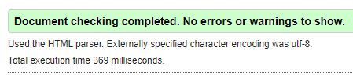
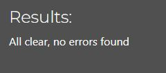

# **Testing**

## Manual Tests

### **HTML Validation**
  + *Description*: Validate HTML code using the W3 HTML Checker.
  + *Steps*:
    1. Copy the HTML code of the templates.
    2. Visit the [W3 HTML Checker](https://validator.w3.org/).
    3. Paste the HTML code and check for any validation errors.
    4. Fix any warnings or errors.
  + *Expected Result*: No validation errors found in the core structure and syntax of HTML.

    **Note**: Due to the dynamic nature of Django templates and the usage of template tags, some errors related to undefined variables or attributes may be expected.

### **Python Linter**
  + *Description*: Ensure Python code adheres to coding standards using a linter (CI Python Linter).
  + *Steps*:
    1. Run the linter on each Python code file.
    2. Review the output for any warnings or errors.
    3. Fix any warnings or errors.
  + *Expected Result*: The code complys with coding standards without any major issues.

### **Responsiveness**

All pages were tested to ensure responsiveness on screen sizes from 320px and upwards. Reflow criteria for responsive design on Chrome, Edge, Firefox and Opera browsers.

Steps to test:

- Open browser and navigate to [movie review with friends](https://movie-reviews-with-friends-96186426856b.herokuapp.com/)
- Open the developer tools (right click and inspect)
- Set to responsive and decrease width to 320px
- Set the zoom to 50%
-  Click and drag the responsive window to maximum width

Expected:

Website is responsive on all screen sizes and no images are pixelated or stretched. No horizontal scroll is present. No elements overlap.

### **Navigation links**
Testing was performed to ensure all navigation links on the pages navigate to the corred pages. This was done by clicking on the navigation links on each page.

| Link                          | Redirect                   |
|-------------------------------|----------------------------|
| Website logo                  | homepage.html              |
| **Movies**                    |                            |
| Movies (Navigation)           | list_of_movies.html        |
| Movie link                    | movie_details.html         |
| "Add to group" button         | movie_details.html         |
| "Back to Movies List" button  | list_of_movies.html        |
| **Groups**                    |                            |
| Groups (Navigation)           | display_groups.html        |
| "Create group" button         | create_group.html          |
| Group link                    | group_details.html         |
| Movie link                    | movie_review_in_group.html |
| "Edit group" button           | edit_group.html            |
| "Delete group" button         | delete_group.html          |
| "Leave group" button (member) | group_details.html         |
| "Leave group" button (admin)  | delete_group.html          |
| **Users**                     |                            |
| Users (navigation)            | display_users.html         |
| User link                     | user_details.html          |
| **Auth**                      |                            |
| Login                         | login.html                 |
| Register                      | register.html              |
| Logout                        | homepage.html              |
| Profile                       | user_profile.html          |
| "Edit Profile" button         | edit_profile.html          |
| "Delete profile" button       | delete_profile.html        |

## **Automated Tests**

### **Registration**
The registration process is tested to ensure that users can successfully register with the required information and that proper validation checks are in place.

**Requirements**
+ **Username**
    + Required.
    + Must be unique, will be checked back with the database.
    + Required. 150 characters or fewer. Letters, digits and @/./+/-/_ only.

+ **E-Mail Adress**
    + Required.
    + Valid E-Mail Address format.

+ **Password**
    + Required.
    + Password can’t be too similar to your other personal information.
    + Password must contain at least 8 characters.
    + Password can’t be a commonly used password.
    + Password can’t be entirely numeric.

+ **Password Confirmation**
    + Required.
    + Password confirmation must match passsword entered beforehand.

**Test Case 1: Valid Registration**
+ **Scenario:** User provides valid registration details.
+ **Steps:**
  1. Navigate to the registration page.
  2. Enter a unique username.
  3. Provide a valid email address (no email confirmation required).
  4. Enter a strong password.
  5. Confirm the password.
  6. Click the "Register" button.
+ **Expected Result:** User is successfully registered and redirected to the login page.
+ **Actual Result:** User is successfully registered and redirected to the login page.

**Test Case 2: Missing Username**
+ **Scenario:** User attempts registration without providing a username.
+ **Steps:**
  1. Navigate to the registration page.
  2. Leave the username field empty.
  3. Provide a valid email address.
  4. Enter a strong password.
  5. Confirm the password.
  6. Click the "Register" button.
+ **Expected Result:** User receives an error message indicating that a username is required.
+ **Actual Result:** User receives an error message indicating that a username is required.

**Test Case 3: Password Mismatch**
+ **Scenario:** User provides mismatched passwords during registration.
+ **Steps:**
  1. Navigate to the registration page.
  2. Enter a unique username.
  3. Provide a valid email address.
  4. Enter a strong password.
  5. Confirm the password with a different value.
  6. Click the "Register" button.
+ **Expected Result:** User receives an error message indicating that passwords do not match.
+ **Actual Result:** User receives an error message indicating that passwords do not match.

**Test Case 4: Invalid Email Address**
+ **Scenario:** User provides an invalid email address during registration.
+ **Steps:**
  1. Navigate to the registration page.
  2. Enter a unique username.
  3. Provide an invalid email address (e.g., user@example).
  4. Enter a strong password.
  5. Confirm the password.
  6. Click the "Register" button.
+ **Expected Result:** User receives an error message indicating that the provided email address is not valid.
+ **Actual Result:** User receives an error message indicating that the provided email address is not valid.

### **Login**

**Requirements**
+ **Username**
    + Required.
    + Provide a username

+ **Password**
    + Required.
    + Provide the password matching the username

**Test Case 1: Valid Login**
+ **Scenario:** User provides valid username and password.
+ **Steps:**
  1. Navigate to the login page.
  2. Enter a username.
  3. Enter a valid password matchin the username.
  4. Click login.
  5. The user is logged in and redirected to the homepage.
+ **Expected Result:** User is successfully logged in and redirected to the homepage page.
+ **Actual Result:** User is successfully logged in and redirected to the homepage page.

**Test Case 2: Incorrect Username**
+ **Scenario:** User attempts to login with an incorrect username.
+ **Steps:**
  1. Navigate to the login page.
  2. Enter an incorrect username.
  3. Enter a password.
  4. Click login.
  5. The user is not logged in and a promt appears "Login failed".
+ **Expected Result:** User receives an error message indicating that the login failed.
+ **Actual Result:** User receives an error message indicating that the login failed.

**Test Case 2: Incorrect Password**
+ **Scenario:** User attempts to login with an incorrect username.
+ **Steps:**
  1. Navigate to the login page.
  2. Enter a username.
  3. Enter an incorrect password.
  4. Click login.
  5. The user is not logged in and a promt appears "Login failed".
+ **Expected Result:** User receives an error message indicating that the login failed.
+ **Actual Result:** User receives an error message indicating that the login failed.

### **Restricted access**
To ensure that only authenticated users can access specific pages and vital functions, several security measures have been implemented.

**User Authentication**:
+ Access to certain pages and functions is restricted to authenticated (logged-in) users only.
+ Users need to log in with a valid username or e-mail address and password to gain access.

The following pages are restricted to logged-in users:
+ Group details
+ User details

The following functions are restricted to logged-in users:
+ Adding movies to groups
+ CRUD functions for Groups
+ CRUD functions for movie reviews
+ CRUD functions for user profiles

When a non-authenticated user tries to access restricted content or functions, they will be redirected to the login page.

**Test Case: Verifying Access Restriction**
+ **Scenario**: Unauthorized user attempts access to restricted pages or functions.
+ **Steps**:
1. Open a browser and log in with a valid user account.
2. Open a separate browser session without logging in.
3. Navigate to a restricted page with the logged-in user and copy the URL.
4. Paste the copied URL into the URL bar of the second browser.
+ **Expected Result:** The unauthorized user is automatically redirected to the login page.
+ **Actual Result:** The unauthorized user is automatically redirected to the login page.

**User-Specific CRUD Functionality Access Control**:
In addition to general user authentication measures, certain CRUD (Create, Read, Update, Delete) functions are restricted to the original creator of the content. This ensures that users can only modify or delete the content they have created. 

**User-Specific Functions:**
+ Adding movies to groups
+ CRUD functions for Groups
+ CRUD functions for movie reviews
+ CRUD functions for user profiles

When a user who is not the original creator attempts to access or modify user-specific content, they will be automatically redirected to the "Access Denied" page.

**Test Case: Verifying CRUD Functionality Access Control**
+ **Scenario**: Unauthorized user attempts to access or modify user-specific pages or functions.
+ **Steps**:
1. Open a browser and log in with a valid user account.
2. Open a separate browser session and log in with another user account.
3. Navigate to a restricted function i.e. editing a review with the logged-in user and copy the URL.
4. Paste the copied URL into the URL bar of the second browser with the other user logged in.
+ **Expected Result:** The unauthorized user is automatically redirected to the Access Denied page.
+ **Actual Result:** The unauthorized user is automatically redirected to the Access Denied page.

### **Error 404**
**Custom error 404 page**:
In addition to the standard error-handling mechanisms, specific measures have been implemented to handle 404 errors, ensuring a more user-friendly and informative experience. When a user attempts to access a page or resource that does not exist, the application responds with a customized 404 error page.

The 404 error page provides clear and concise information, letting the user know that the requested page or resource could not be found.

**Test Case: Custom error 404 page**
+ **Scenario**: A user tries to access a URL that is not valid.
+ **Steps**:
1. Open a browser and open the homepage.
2. Open pages and add random number or letter to the url and hit enter.
+ **Expected Result:** The user will be redirected to the custom error 404 page.
+ **Actual Result:** The user will be redirected to the custom error 404 page.
